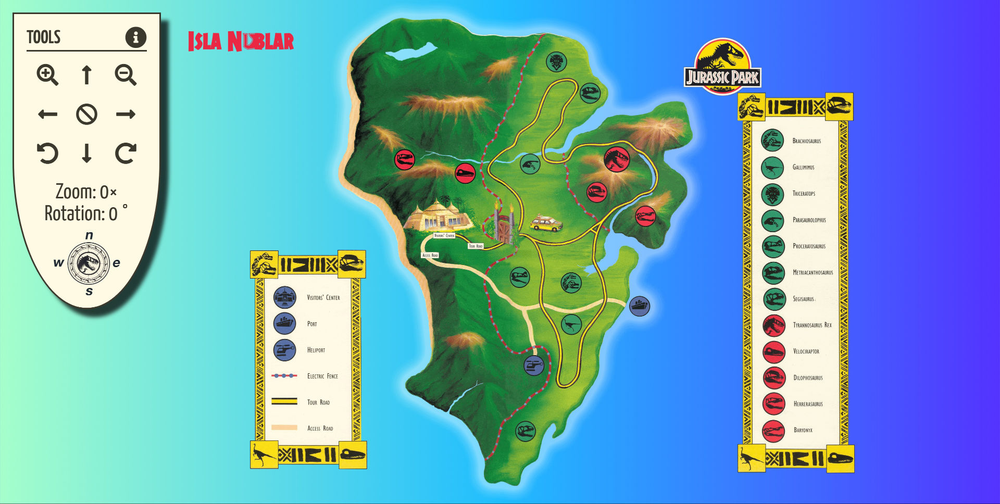

# College of Multimedia Opdracht MM-4

__Opdrachtomschrijving__

"Maak een mini-website over computertechnologie. De website bestaat uit een homepage en twee vervolgpagina's. De twee vervolgpagina's bevatten informatie over computeronderdelen, zoals de harde schijf of het moederbord."

[Live demo opdracht MM-4](https://cmm-front-end-developer-module-2-mm-4.netlify.app)

## Screenshot Project MM-4
